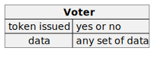
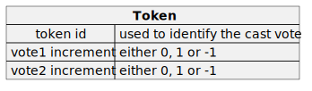
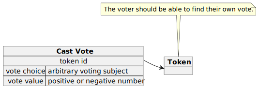

# Electronic voting

## Preambula
The main challenge facing any voting system is ensuring the confidentiality
of the vote while maintaining the ability to verify the cast ballots.
In traditional offline systems, anonymity is achieved through the use of
anonymous ballots, and oversight is carried out by public observers during
the vote counting process.

In the case of electronic voting, there arises a practically irresolvable
contradiction between the necessity of controlling the cast vote and,
simultaneously, the imperative to keep it confidential to prevent
potential influence on the voter.

The objective of this project is to address the mentioned contradiction
and suggest a voting system that meets both the requirement ofcontrolling
cast votes and ensuring their confidentiality. Additionally, the project
aims to satisfy other requirements imposed on electoral processes.

## Requirements to voting process

### 1. Only those who are authorized to participate in the voting process are eligible to cast their votes

At first glance, this condition is not particularly unique and is achieved
by creating a registry of voters. However, a technical challenge arises in
associating the registry with real individuals. In the case of offline
voting, this issue is typically addressed using a some ID, whereas in
electronic voting, there is no single solution. It can be addressed with
plug-in components of varying complexity, ranging from email to
government-provided certificates.

### 2. Each voter is allowed to cast only one vote

During offline voting, a voter typically receives a paper ballot for
a single vote, accompanied by a simultaneous mark indicating its issuance.
Electronic voting follows the same approach, with the distinction that
instead of a paper ballot, an electronic token is issued, obtained online
through the processing of an electronic application. Simultaneously, the
token issuance is recorded in the voter registry, preventing its duplicate
issuance. At the token issuance moment, a verification is conducted to
ensure the applicant's correspondence with the registry entry. At the
moment of voting, the token increments the count of cast votes by exactly
one.

### 3. Protection against vote stuffing

Traditional offline voting lacks protection against the insertion of
fraudulent votes. However, in the case of electronic voting, such
verification is straightforward: by knowing the issued tokens, it is
always possible to check the database of cast votes. On the other hand,
the voter can always locate their token and ensure that it is included
in the overall tally. As a technical measure to ensure the fairness of the
voting process, the voting database may only permit the addition of votes,
while removal and modification are not possible.

### 4. Ensuring the confidentiality of the vote

This requirement has remained unresolved in the case of offline voting:
there is a possibility of exerting pressure on the voter through coercion,
such as taking a photograph of the ballot, to influence their choice.
Protection against this threat is lacking in offline systems and requires
additional measures in electronic voiting. 

The idea behind protecting against the threat of coercion to disclose
voting information lies in the ability to vote multiple times,
thus concealing one's actual vote. 

The possibility of re-voting arises if each subsequent token application
cancels the previous vote. However, this leads to a contradiction with
the requirements of immutability and anonymity: to annul previous votes,
knowledge of the prior choice and modification of the voting database is
necessary, opening the door to potential result tampering.

This contradiction is resolved by issuing a cancel token after voting. Apply
ing this token adds a record to the database with a value of minus 1 for the
voting result. Thus, applying both the voting token and the cancel token
does not require modifying the database but effectively resets the count of
cast votes to zero. After applying the cancel token, the voter receives a
new token for the next vote and can change their decision. The process of
voting and canceling can be repeated indefinitely, making control over the
voting process impossible and meaningless.

## Implementation

### Components

#### A registry of voters

The voter registry contains records with a very simple structure, where the
minimally required fields are only a unique identifier for the voter and a
field to mark that they have already received a voting token, preventing
its duplicate issuance. However, the voter registry may also include
public available data, for example, for additional validation of
the voting participant.

#### A registry of issued tokens

The voting token necessarily includes a unique identifier that allows the
voter to locate their vote in the voting database and ensure that it will
be counted. Additionally, the token contains values by which votes will
increase when the token is applied for voting. The very first token issued
to the voter contains 1 in one of the fields and 0 in the rest. A token
for a re-vote will contain -1 in the field of the previous vote, 1 in the
field for the next vote, and zeros in the others.

_It is crucial to note that there is no correlation between the voter
registry and the token registry: it is impossible to ascertain which
tokens were issued to a specific voter except through the voter who
received the token themselves._

#### A voting database

Entries in the database include a reference to the voting token, ensuring
that the token owner is confident their vote was counted. Additionally, it
indicates the value that should be added (or subtracted) from the total
count of all votes cast for the voting subject

### Flow

#### Voter's view
==TODO:==
#### Technical perspective
==TODO:==
